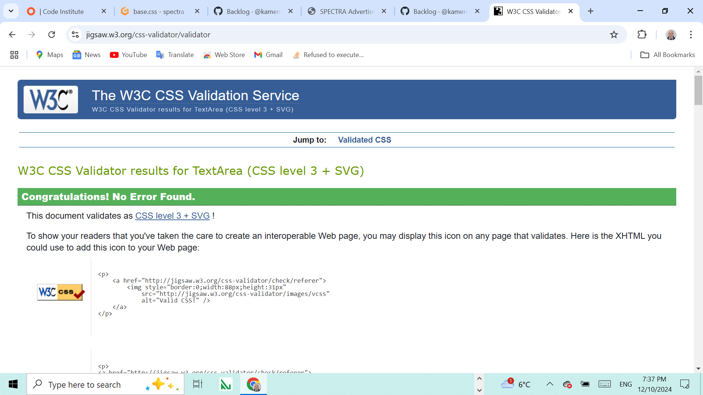

# Varna Eats - Restaurant

## Performance of the web page on different devices

The site displayed on Notebook 13" 1024x800px.

The site displayed on iPad Mini 13" 768x1024px.

The site displayed on iPhone13 390x844px.

[Click on this link to visit the site on Heroku](https://spectro-b475a4cbad8c.herokuapp.com/)

# Content

## Table of Content 
1. [Wireframe](#wireframe)
2. [UX Description](#ux-description)
3. [Technologies used](#technologies-used)
4. [Website Features](#website-features)
5. [Features to implement](#other-features)
6. [Agile palnning](#agile-planning)
7. [Project structure](#project-structure)
8. [Testing and Validation](#testing-and-validation)
9. [Bugs and Issues](#bugs-and-issues)
10. [404 page](#notfound-page)
11. [Deployment](#deployment)
12. [Credits](#credits)

---

## [Wireframe](#wireframe)

Spectra advertising is a web application that allows users to view the company products displayed on the project page, to sign in, place anorder, make online payments and from his/her profile page to download the finishd project. This project is built using Django and is deployed on Heroku.

---

## [UX Description](#ux-description)

This site was designed predominantly for advertising agencies and companies as well as freelanced graphic designers, where they showcase their products. From the profile page the owner or manager using the superuser account can view all the placed orders, and update the users' profile by directly uploading ready projects to the user's profile page, while the users can see all the orders they have made in their profile pages. This is achieved by using databases SQLite for development and PostgresSql for production.  

The layout is kept pretty simple, with three pages describing the SPECTRA activities, the product page showing the products and the order page from where the customer can make reservations by filling and sending the form. At the far right is the login button from where the owner or the manager can log in to view all orders and to upload the ready projects. Using this button users and customers can log in and after that they can place orders by describing and choosing their product from the dropdown menu. The payment is mad eby stripe and success page is displayed temporarily in the session and is filed permenantly in the user's profile.

---

## [Technologies used](#technologies-used)

- HTML5, Django templates. Used to structure my website. There is only one page base.html of this website  and using Django template mark up the rest of the pages extend the base.html

 Semantic element have been used like container, row, form, div.
 
  Responsive design was implemented by the code in the head with metatag defining the control of page's dimensions and scaling.

- CSS3, Bootstrap: Bootstrap container class provides a responsive fixed-width container.
 The row class is used to create a horizontal group of columns.

 Responsive web design is used to resize, and shrink, the content to make it look good on any screen.  Box sizing border box was used to  padding and border of element's total width and height. Media query with breakpoint of 420px was used for the responsiveness of the page. Hover css was used on the nav bar onclicking the login, and also onclicking the buttons in the nav panel.

- JavaScript and Stripe technologies are used. JavaScript code integrates Stripe payments in the checkou.html The stripe function initialazes the stripe object using the stripe public key. JavaScript code creates elements and card input using Stripe's predefined style and functionality and attaches the card input to the HTML element.  Submit event listener prevents the default form submission behaviour(using event.preventDefault()), allowng the code to handle the payment asynchronously. JavaScript validates the required fields and if any fields are empty displays an error message. Client's secret is used to confirm the payment, and handles the payment by displaying an error message or success.html page.

- Python3, Datetime, Django libraries are imported in the main python file, settings.py and also in views.py and models.py. Whitenoise is installed, PostgreSql is used for the menu database. Database models are defined for Order and Graphic Order. Graphic order is an order for design in a database.Django database models are imported with clsses nd fields. User Model is imported from Django build-in authentication system to associate graphic orders with specific users. This model tracks orders for graphic designs, linking them to specific users. This model will be used to store, retrieve, and manage graphic order data in the Django application.
The Order model is used for managing and tracking user orders, providing all necessary fields for basic order information. This model links each order to a specific user using foreign key to the user model.

- Github - The cloud based service for hosting repositories for over 73 million developers
- Git - Used to add, commit and push my changes to the server and to create a repository with the help of The Code Institute template.
- Favicon.io - Used to source my favicon icons for my website.
- Google Fonts - Used to source different fonts in my css file. Google font were used Roboto.
- CoralDraw was used to create the mockup social medi product page.
- This page was made with Visual Studio Code on gitpod.io, and for deploying the pages the 
git add . git commit and git push commands were used.
- Gitpod.io was used to work on the project.
- Heroku was used to deploy my site.
- AWS S3 was used to store the dynamic uploaded pictures.
- Whitenoise is used to handle tha static files and pictures.
  
---

## [Website Features](#website-features)

- The user is able to view the products with price and product information.
- The user will be able to log in and view his/her profile page. The logged in users will be able to place an order and make online payments.
- Login and manage the menu (add, update, delete recipes).
- Task management functionality includs login as superuser, viewing all orders and uploading the ready files.

---

## [Features to implement](#other-features)

Given more time to invest in the project, I would like to implement some more features: 

- The site can be extended to offer a wide variety of offset printed products like businessn cards, leaflets, posters, cathalogues, local newspapers, selling of souveniers with printed logo of the customers, with included delivery option. 
- To implement an email sending while submitting the order with payment.
- The user should be able to log in with their social accounts as many users will be unwilling to make a special registration for this site. The registration with the social accounts will give the management to track their online activity.  
- JavaScript google map can be embeded to facilitate thu users if they need to find the adress of the company.
- The users should be able to participate in forum, blog application from where they can make comments of the service. This application will be built in the future.
  
 ---
 
## [Agile planning](#agile-planning)

Severel steps were taken into consideration to develop this project. **Requirements** were detailed, **analyses** performed to see what technologies might be used, the **design** was made using bootstrap and CSS combined the **development** was carried out on gitpod.io, **testing** was made only manually, the authomatic testing was abondened due to lack of time. **User stories** Represent a small functionality that aims to capture and visualize the value for the end customer. User stories consist of multiple tasks/subtasks. All of that is visualized and managed through interactive Kanban boards.
Several development cycles were followed **1st cycle iteration** creating the HTML and CSS structure. **2nd cycle iteration** implementing Django template language and Django. **3rd cycle iteration** creating the Postgres database with order/views.py, order/models.py  for the order form. **4th cycle iteration** Creating order application with SQLLite database for development and PostgresSql for production with models for graphic design order. **5th cycle iteration** Creating the checkout model. On submitting the checkout.html emai is not sent to the customer.

The Agile tool used for this project is Git Project.

[This is the link to Kanban board on github](https://github.com/users/kamenco/projects/9/views/1)

Dummy social media product page, as demonstrated in the learning material. 

---

 ## [Project structure](#project-structure)

    |-- SPECTRA
      |-- accounts/
        |--templates/
          |--login.html
          |--logout.html
          |--registration.html
      |-- avertise/
        |-- settings.py
        |-- urls.py
      |-- checkout/
        |-- templates
          |-- checkout.html
          |-- success.html
      |-- home
        |-- templates/
          |-- index.html
        |-- url.py
        |-- views.py
      |-- media/
        |--  images/
      |-- order/
        |-- templates/
          |-- order.html
        |--forms.py
        |-- models.py
        |-- urls.py
        |-- views.py
      |-- product
        |-- templates
          |-- product.html
        |-- models.py
        |-- views.py
        |-- urls.py
      |-- static/
        |-- css/
          |-- style.css
        |-- images/
      |-- templates
        |-- base.html
      |-- upload
        |-- templates
          |-- all_orders.html
          |-- upload_completed_work.html
        |-- models.py
        |-- views.py
        |-- urls.py
      |-- env.py
      |-- manage.py
      |-- procfile
      |== requirements.txt
        
    ---  
    
 ## [Testing and Validation](#testing-and-validation)

 The HTML and CSS coding was tested on https://validator.w3.org

 

 Javascript validation. The javascript files have been checked on www.jshint.com. 

 

 Javascript validation gives warnings because of these placeholders  {{ ... }}. JavaScript inteprets them as invalid JavaScript  syntax, because it is a placeholder for serverside template rendering. When replaced with this it is OK.

                    const stripe = Stripe('your_public_key_here');
                    const { error, paymentIntent } = await stripe.confirmCardPayment('your_client_secret_here', {

---
Stripe submission validation.

Validation from stripe.com

Validation from stripe.com for adding the endpoint with added events.

 Python validation

Python is validated on CI Python linter The HTML and CSS coding was tested on https://validator.w3.org
 
 
---

The page is tested on different browsers Chrome, Firefox, Safari, Opera. The page is responsive and contains all the functions accross differenr screens and sizes. The accessibility testing.
For testing accesibility and SEO and Best Practices, I used Lighthouse in Dev tools. 
Lighthouse runs an audit of your website and feeds back a set of scores for accessibility, SEO and best practices among others.

Lighthouse testing.

This is python automatic testing.

                  import smtplib

                  with smtplib.SMTP("smtp.gmail.com", 587) as server:
                  server.starttls()  # No extra arguments here
                  server.login("kamenkirov59@gmail.com", "EMAIL_HOST_PASS")
                  print("Connected successfully.")

Python testing that uses smtplib module to establish a connection with Gmail's SMTP server for sending emails.  smtplib provides a wayto send emailsusing the Simple Mail Transfer Protocol (SMTP) It includes methods for establishing connections with an SMTP server, logging in and sending messages.

---
## [Bugs and Issues](#bugs-and-issues)

After implementing login required when submitting the order, the login and logout pages could not be found. Got an error TemplateDoesNotExist at accounts/login. The bug was resolved after a new folder registration in project folder/templates/registration was created.

No order_type is passed or it is invalid, the user sees an error or be redirected to the order page. I had to ensure that the order_type is being passed correctly from the frontend (order.html) to the backend (checkout view).

The success.html does not show the order_type,  descrption and price. Debugging steps created:

         print("Order Type:", request.session.get('order_type'))
         print("Description:", request.session.get('description'))
         print("Price:", request.session.get('price'))

And data was passed to success.html template.

        return render(request, 'success.html', {
        'message': 'Your payment was successful!',
        'order_type': order_type,
        'description': description,
        'price': price,
        })

/workspace/spectra/upload/templates/upload/all_orders ls givesshows that these two files exist all_orders.html and upload_complete_work.html 

This bug was tested with python test. 

        from django.template.loader import get_template
        get_template('upload/all_orders.html')

This codes shows that the template all_orders.html does not exist. The bug was resolved after deleting all_orders.html and creating a new file all_orders.html, which shows that the file was somehow corrupted.

This bug appeared because the Pillow has been installed but has not been freezed in the requirements.txt After adding Pillow to the requirements.txt the issue was resolved.

---

## [404.html](#notfound-page)

Django configuration to use the Custom 404.html page. In settings.py DEBUG=False in production mode, and ALLOED_HOSTS=['https://dinesdj-cb401df90931.herokuapp.com/', 'localhost']

 - ---

## [Deployment](#deployment)

Cloudinary storing the pictures that are dynamically uploaded by the user.
API_KEY, API_SECRET and CLOUDINARY_NAME  used from cloudinary.com and implemented into the web site.

Heroku deployment
To deploy Your App to Heroku, you have to :

+ Create a Heroku account.
+ From the dashboard select create new app.
+ Enter a name for your app, it needs to be unique, and select your region then press create app.
+ Select settings at the top of your app page.
+ Press reveal config vars.
+ Scroll down and press the add buildpack button.
+ Scroll back up and select Deploy at the top of your app page.
+ Choose your deployment method, when choosing Github, you will have to connect to your account.
+ Then choose which repo you want to deploy and connect to it.
+ Choose if you want to deploy automatic or manual, and press deploy.

**To fork this repository on Github, you have to:**

+ Go to my GitHub repository.
+ In the top-right corner of the page, click Fork.
+ Under "Owner," select the dropdown menu and click an owner for the forked repository.
+ Click Create fork.

**To clone this repository, you have to:**

+ Go to my GitHub repository.
+ Above the list of files, click Code.
+ Copy the URL for the repository.
+ Open Git Bash.
+ Change the current working directory to the location where you want the cloned directory.
+ Type git clone, and then paste the URL you copied earlier.
+ Press Enter to create your local clone.

---

## [Credits](#credits)

 The idea for the bootstrap design was taken from https://www.w3schools.com/.
 
 This site was build with the help of www.chatgpt.com, but most important with the lectures of www.codeinstitute.net and namly the lectures for emailjs.com and the task application.
 
 Pictures recepies and links for the pictures were taken from www.bgtown.com
 
 Some of the styling was made with the help of www.bootstrap.com 
 
 The chef's logo was taken free from https://logo.com/
 
 The photos were taken from www.pexels.com
 
The idea for the site was accepted from the Code Institute reccomendation for project 4. 

This side is used with the help of Codeacademy's course and the help of the tutors and facilitators, and mentors. Special thanks to facilitator Laura for sending me useful links for testing, thanks to my tutor Mr. Medale. Special thanks to all the tutors, I will mention the names of the last two as I can remember only their names Rebecca and Tom, but there were several other tutors that helped a lot.

[Back to top](#wireframe)

