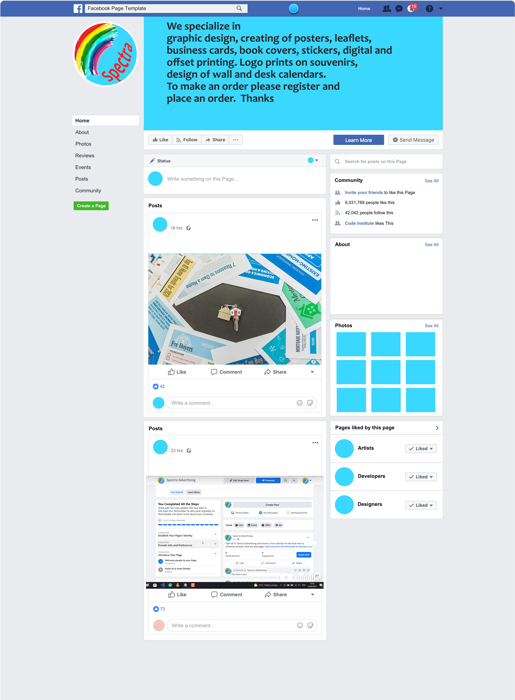

# Varna Eats - Restaurant

## Performance of the web page on different devices

[Click on this link to visit the site on Heroku](https://dinesdj-cb401df90931.herokuapp.com/)

# Content

## Table of Content 
1. [Wireframe](#wireframe)
2. [UX Description](#ux-description)
3. [Technologies used](#technologies-used)
4. [Website Features](#website-features)
5. [Features to implement](#other-features)
6. [Agile palnning](#agile-planning)
7. [Project structure](#project-structure)
8. [Testing and Validation](#testing-and-validation)
9. [Bugs and Issues](#bugs-and-issues)
10. [404 page](#notfound-page)
11. [Deployment](#deployment)
12. [Credits](#credits)

---

## [Wireframe](#wireframe)

Varna Eats is a web application that allows users to view the menu, make reservations, and manage tasks. This project is built using Django and is deployed on Heroku.

---

## [UX Description](#ux-description)

This site was designed predominantly for restaurant owners, where they can present their restaurants, the menus, and where they can update the manues using postgres database, they can also add recepies, update recepies and delete recepies with using postgres as a database. Form the application menu, using databaase SQLLIte for development and PostgrsSql for production the owner or the manager of the restaurant can add menu items with photo, text and price. From tasks the manager can add, update tasks and delete tasks. The site has also a interactive javascript map facilitating the customers by showing the restaurant's whereabouts. 

The layout is kept pretty simple, with three pages describing the Bulgarian cuisine, the menu page and the contact page from where the customer can make reservations by filling and sending the form. At the far right is the login button from where the owner or the restaurant manager can log in to update, delete and add recepies of the menu page. From there he can also add tasks, update and delete tasks, helping the management to better organize his business.

---

## [Technologies used](#technologies-used)

- HTML5, Django templates. Used to structure my website. There is only one page base.html of this website  and using Django template mark up the rest of the pages extend the base.html

 Semantic element have been used like container, row, form, div.
 
  Responsive design was implemented by the code in the head with metatag defining the control of page's dimensions and scaling.

- CSS3, Bootstrap: Bootstrap container class provides a responsive fixed-width container.
 The row class is used to create a horizontal group of columns.Justify-content-center: This class centers the content horizontally within the row. col-sm-8: sets the width of the content to 8 columns out of a 12-column grid on small and larger devices, and you can adjust it as needed.
 btn-block used to buttons for full-width styling. button classes to btn-primary and btn-danger for better visual distinction.

 Responsive web design is used to resize, and shrink, the content to make it look good on any screen.  Box sizing border box was used to  padding and border of element's total width and height. Media query with breakpoint of 420px was used for the responsiveness of the page. Hover css was used on the nav bar onclicking the login, and also onclicking the buttons in the nav panel.

- JavaScript. Used to provide functionality to my website. Event listener used is to handle form submission and send the form data using EmailJS. Included the EmailJS SDK script in the contact.html file. Javascript was used to embed the google map. JavaScript function confirmDelete was used for the defensive design of the delete task. confirmDelete function is used from base.htm  confirmDeleteRecipe and confirmDeleteTask functions are defined and utilized within individual HTML templates.Onsubmit attribute in the delete form calls confirmDelete(event), which asks for confirmation before submitting the delete form. By clearly defining separate routes and ensuring the JavaScript functions are scoped to specific pages, I avoid collisions between the delete actions on different pages. This approach helps to ensure that both the delete functionality for recipes and tasks work independently without interfering with each other.

- Python3, Datetime, Django libraries are imported in the main python file, settings.py and also in views.py and models.py. SQLAlchemy is installed, PostgreSql is used for the menu database. Database models are defined for Cathegories and tasks.
The delete_task, add_task, update_task routes are used to correctly handle POST requests to delete, update and add a task and redirect back to the tasks list. Used url_for function to correctly points to the Django routes. Delete_task, update-task, and add_task routes accept the correct HTTP methods (GET, POST). Ensured Unique URLs for Delete Actions. Making sure the URLs for the delete actions in both update_menu.html and update_task.html are distinct. Handling POST Requests: The update_menu function is updated to load recipes at the beginning. If the request is a POST request and the form contains 'add', it adds the new recipe. If the form contains 'delete', it deletes the selected recipe and writes the updated list back to the database.

- Github - The cloud based service for hosting repositories for over 73 million developers
- Git - Used to add, commit and push my changes to the server and to create a repository with the help of The Code Institute template.
- Favicon.io - Used to source my favicon icons for my website.
- Google Fonts - Used to source different fonts in my css file. Google font were used Roboto.
- CoralDraw was used to illustrate this page with the flow chart's logic.
- This page was made with Visual Studio Code on gitpod.io, and for deploying the pages the 
git add . git commit and git push commands were used.
- Gitpod.io was used to work on the project.
- Heroku was used to deploy my site.
- Cloudinary was used to store the dynamic uploaded pictures.
- Whitenoise is used to handle tha static and pictures.
  
---

## [Website Features](#website-features)

- View the menu with various recepies.
- Make reservations through a contact form.
- Login and manage the menu (add, update, delete recipes).
- Task management functionality including adding, updating, and deleting tasks.
- Send email for reservations

---

## [Features to implement](#other-features)

Given more time to invest in the project, I would like to implement some more features: 

- The menu page except menues to have an option for online payment and booking, and also a delivery for home.
  
- The form from the contact page should have dropdown menu for date and time of the reservation, also dropdaown for the main course, starters, desserts, so that those booking for functions, celebrations, receptions and parties can fix their menu beforehand online.
- To fulfil authomatic testing. For now only manual testing is carried out.  
- This project can target restaurant owners and catering services.
- This project has a registration link from the login of the customers to be directed to the forum, blog application from where they can make comments of the service. This application will be built in the future.
  
 ---
 
## [Agile planning](#agile-planning)

Severel steps were taken into consideration to develop this project. **Requirements** were detailed, **analyses** performed to see what technologies might be used, the **design** was made using bootstrap and CSS combined the **development** was carried out on gitpod.io, **testing** was made only manually, the authomatic testing was abondened due to lack of time. **User stories** were found regarding the usage of the contact submit form, for phones, which are widely used for internet it is difficult, or almost impossible to put the phone numbers with hifens.
Several development cycles were followed **1st cycle iteration** creating the HTML and CSS structure. **2nd cycle iteration** implementing Django template language and Django. **3rd cycle iteration** creating the Postgres database with menu/views.py, menu/models.py  for the menues. **4th cycle iteration** Creating task application with SQLLite database for development and PostgresSql for production with models for categories and tasks. **5th cycle iteration** Creating the contact page with the submit form. Pure python project was abandoned as too complex and unfeasible, in terms of user and password requirements. Implemented the technology ofEmailjs.com for the form submission.

The Agile tool used for this project is Git Project.

[This is the link to Kanban board on github](https://github.com/users/kamenco/projects/8/views/1)

Dummy social media product page, as demonstrated in the learning material. 

---

 ## [Project structure](#project-structure)

    |-- DINESTWO
      |-- accounts/
        |--templates/
          |--login.html
          |--logout.html
          |--registration.html
      |-- contact/
        |--templates
          |--contact.html
      |-- dines/
        |--settings.py
        |--urls.py
      |-- home/
        |-- templates/
          |-- index.html
        |-- url.py
        |-- views.py
      |-- media/
        |--  menu_images/
      |-- menu/
        |-- templates/
          |-- menu.html
          |-- update_menu.html
        |--forms.py
        |-- models.py
        |-- urls.py
        |-- views.py
      |-- static/
        |-- css/
          |-- style.css
        |-- images/
      |-- staticfiles/
        |-- cloudinary/
        |-- css/
        |-- images/
      |-- task/
        |-- templates/
          |-- add_task.html
          |-- tasks.html
          |-- update_task.html
        |-- models.py
        |-- urls.py
        |-- views.py
      |-- templates/
        |-- base.html
      |-- gitignore
      |-- db.sqlite3
      |-- env.py
      |-- manage.py
      |-- Procfile
      |-- requirements.txt
      
    ---  
    
 ## [Testing and Validation](#testing-and-validation)

 The HTML and CSS coding was tested on https://validator.w3.org

 

 Javascript validation. The javascript files have been checked on www.jshint.com. 

 

 Javascript validation

---
Stripe submission validation.

Validation from stripe.com

Validation from stripe.com for adding the endpoint with added events.

 Python validation

Python is validated on CI Python linter The HTML and CSS coding was tested on https://validator.w3.org
 
 
---

The page is tested on different browsers Chrome, Firefox, Safari, Opera. The page is responsive and contains all the functions accross differenr screens and sizes. The accessibility testing.
For testing accesibility and SEO and Best Practices, I used Lighthouse in Dev tools. 
Lighthouse runs an audit of your website and feeds back a set of scores for accessibility, SEO and best practices among others.

---
## [Bugs and Issues](#bugs-and-issues)

After implementing login required when submitting the order, the login and logout pages could not be found. Got an error TemplateDoesNotExist at accounts/login. The bug was resolved after a new folder registration in project folder/templates/registration was created.

No order_type is passed or it is invalid, the user sees an error or be redirected to the order page. I had to ensure that the order_type is being passed correctly from the frontend (order.html) to the backend (checkout view).

The success.html does not show the order_type,  descrption and price. Debugging steps created:

         print("Order Type:", request.session.get('order_type'))
         print("Description:", request.session.get('description'))
         print("Price:", request.session.get('price'))

And data was passed to success.html template.

        return render(request, 'success.html', {
        'message': 'Your payment was successful!',
        'order_type': order_type,
        'description': description,
        'price': price,
        })

/workspace/spectra/upload/templates/upload/all_orders ls givesshows that these two files exist all_orders.html and upload_complete_work.html 

This bug was tested with python test. 

        from django.template.loader import get_template
        get_template('upload/all_orders.html')

This codes shows that the template all_orders.html does not exist. The bug was resolved after deleting all_orders.html and creating a new file all_orders.html, which shows that the file was somehow corrupted.

This bug appeared because the Pillow has been installed but has not been freezed in the requirements.txt After adding Pillow to the requirements.txt the issue was resolved.

---

## [404.html](#notfound-page)

Django configuration to use the Custom 404.html page. In settings.py DEBUG=False in production mode, and ALLOED_HOSTS=['https://dinesdj-cb401df90931.herokuapp.com/', 'localhost']

 - ---

## [Deployment](#deployment)

Cloudinary storing the pictures that are dynamically uploaded by the user.
API_KEY, API_SECRET and CLOUDINARY_NAME  used from cloudinary.com and implemented into the web site.

Heroku deployment
To deploy Your App to Heroku, you have to :

+ Create a Heroku account.
+ From the dashboard select create new app.
+ Enter a name for your app, it needs to be unique, and select your region then press create app.
+ Select settings at the top of your app page.
+ Press reveal config vars.
+ Scroll down and press the add buildpack button.
+ Scroll back up and select Deploy at the top of your app page.
+ Choose your deployment method, when choosing Github, you will have to connect to your account.
+ Then choose which repo you want to deploy and connect to it.
+ Choose if you want to deploy automatic or manual, and press deploy.

**To fork this repository on Github, you have to:**

+ Go to my GitHub repository.
+ In the top-right corner of the page, click Fork.
+ Under "Owner," select the dropdown menu and click an owner for the forked repository.
+ Click Create fork.

**To clone this repository, you have to:**

+ Go to my GitHub repository.
+ Above the list of files, click Code.
+ Copy the URL for the repository.
+ Open Git Bash.
+ Change the current working directory to the location where you want the cloned directory.
+ Type git clone, and then paste the URL you copied earlier.
+ Press Enter to create your local clone.

---

## [Credits](#credits)

 The idea for the bootstrap design was taken from https://www.w3schools.com/.
 
 This site was build with the help of www.chatgpt.com, but most important with the lectures of www.codeinstitute.net and namly the lectures for emailjs.com and the task application.
 
 Pictures recepies and links for the pictures were taken from www.bgtown.com
 
 Some of the styling was made with the help of www.bootstrap.com 
 
 The chef's logo was taken free from https://logo.com/
 
 The photos were taken from www.pexels.com
 
The idea for the site was accepted from the Code Institute reccomendation for project 4. 

This side is used with the help of Codeacademy's course and the help of the tutors and facilitators, and mentors. Special thanks to facilitator Laura for sending me useful links for testing, thanks to my tutor Mr. Medale. Special thanks to all the tutors, I will mention the names of the last two as I can remember only their names Rebecca and Tom, but there were several other tutors that helped a lot.

[Back to top](#wireframe)

